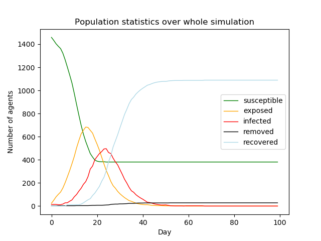
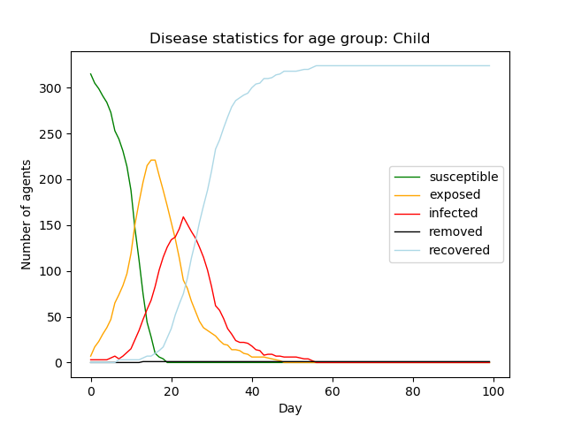
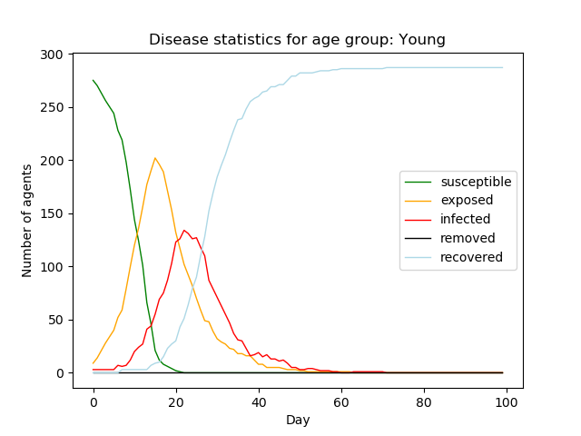
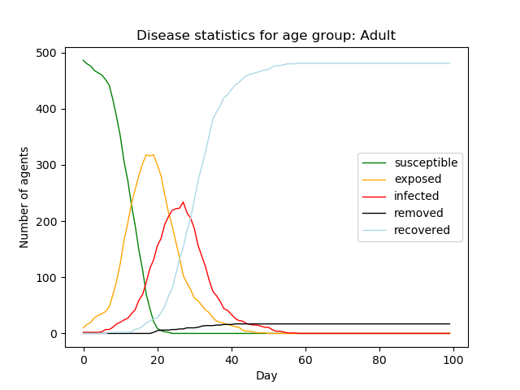
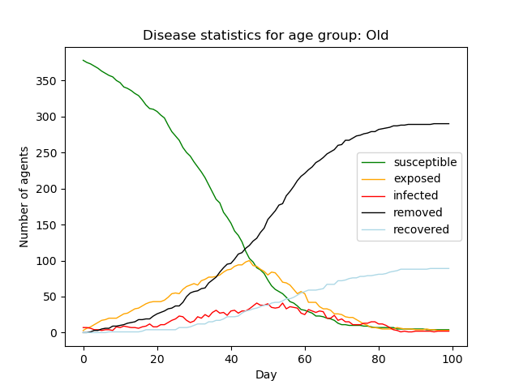
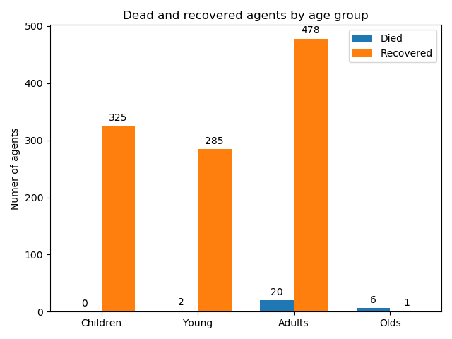

# Impact of Different Measures and Behaviour Scenarios onCOVID-19 Spread - Agent Based Approach

## Abstract
The pandemic of COVID-19 has a significant impact on people’s lifestyle all over the world and has forced countries to adopt different measures to slow its spread. In this study, we constructed an Agent-Based model, which we use to evaluate the influence of different levels of lockdown along with a varying percentage of agents wearing masks. Agents were split up into four age groups according to the population demographics of the Netherlands and were scheduled to meet each other accordingto contact matrices acquired from previous research. After running a preliminary search on each combination of the possible parameters of the simulation, it was found that apart from adopting severe lockdown measures, a great reduction of infection rates can be achieved by reducing socialcontacts by 50% combined with 80% to 100% of the population wearing masks. Furthermore, virus related deaths decreased heavily once lockdown strategies and mask behaviours were enforced onthe elderly agents in the simulation. To reduce infection rate, strategies must apply to each member of the population rather than a single age group. We believe, that this approach will give a clear view on which restrictions are helpful to deal with the pandemic, and discover the consequences of not following the suggested limitations.

## Model design

The method we decided to use for simulating the transmission of a virus is the SEIR model. In the SEIR approach each agent can be susceptible to receiving the virus (S), be exposed to it (E), infected with corona (I), recover or either removed from the simulation (R). The agents in the model represent individuals that belong to one of four different categories: Children, Young Adults, Adults and Elderly. 

### Parameters of the model 

   Parameter  | Value 
   ------------- | ------------- 
   Transition to "Infected"  | 1−exp (1/dL)  
   P(child’s death)  | 1/10647
   P(young's death) | 7/33345
   P(adult's death) | 194/40833
   P(old's death) | 6191/32056
   dL (incubation period) | 6 days
   Infection period | 7 days
   P(infection) per exposure | 0,5
   Mask exposure risk reduction | 20%

Parameters are fixed and based on available research regarding COVID-19 epidemic, except the two last ones - these are set by us.

## How to start a simulation

- Make sure you have Python 3.7.6 installed
- `python -m pip install --upgrade pip`
- `pip install -r requirements.txt`
- `python launchModel.py`

## How to change simulation settings

After running `python launchModel.py`, the user interface will allow to display default settings of the simulation:

Parameter | Value
-------------|------------
Number of days (days) |  100
Population (agents) |  1500
Initial number of infected (init_infected) |  15
Mask chance (mask_chance) |  half
School (school) |  False
Children lockdown settings (child) |  severe
Young Adult lockdown settings (young) |  none
Adult lockdown settings (adult) |  none
Elderly lockdown settings (old) |  none
Live graphs (live_graph) | True

Those settings can be easily changed by pressing "2" button. The interface will proceed changes and allow to run the simulation.

## Overview of program files

- launchModel.py -> Set and run the simulation
- visualisation/
  - dataCollector.py -> Collects time series data during the simulation and saves in dictionaries.
  - visualisation.py -> Module responsible for drawing the results in graphs, as well as for live graphs.
- model/
  - virusModel.py -> Most important class, definition of the model. All simulation operations are performed there.
  - simulationInitialiser.py -> Initialises places and assigns agents to them.
  - areas/
    - area.py -> Main area module, meeting and infecting functions are implemented there. Other classes in 'areas' folder inherit from this class. 
  - agents/
    - baseAgent.py -> Agent class. All methods of agents are implemented there. Other classes in 'agents' folder inherit from this class.
  - fileIO/
    - readData.py -> Module responsible for readng contact matrices from excel files.
 

## Output of the program

At the end of simulation, program prints statistics of each age group as well as of the whole population of agents. Moreover, it saves graphs in the "visualisation/plots/" directory, which might be useful for the further analysis. Example output plots from the baseline experiment (without any restrictions) are presented below:

 
 
 

## Authors

- [CharlieAprog](https://github.com/CharlieAprog)
- [brown532](https://github.com/brown532)
- [juanjoguerrero8](https://github.com/juanjoguerrero8)
- [DanielSalamon](https://github.com/DanielSalamon)

