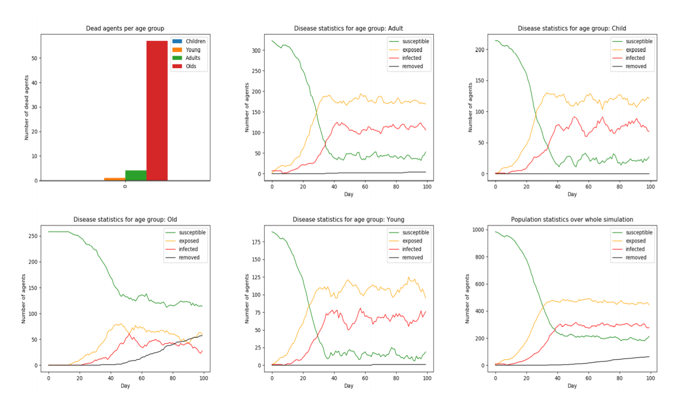

# Impact of Different Measures and Behaviour Scenarios on COVID-19 Spread - Agent Based Approach

<<<<<<< HEAD
Epidemic of COVID-19 has a significant impact on people's lifestyle all over the world. It has paralyzed economic situation of many countries and lowered the sense of security of whole societies. One of possible solutions to fight against this pandemic reality, that the governments can undertake, is to impose several social restrictions. In this study, we propose a Agent-Based model, which we will use to evaluate the influence of those restrictions on the COVID-19 spreading. The model is based on previous research regarding social contacts between people in four age groups (Child, Young, Adult, Old), the impact of disease on people in different ages. We also will perform a list of experiments with different behavioral scenarios. We believe, that this approach will give a clear view on which restrictions are helpful to deal with epidemic, and what are the consequences of not following the suggested limitations.

## Model design
=======
## Abstract
The pandemic of COVID-19 has a significant impact on people’s lifestyle all over the world and has forced countries to adopt different measures to slow its spread. In this study, we constructed an Agent-Based model, which we use to evaluate the influence of different levels of lockdown along with a varying percentage of agents wearing masks. Agents were split up into four age groups according to the population demographics of the Netherlands and were scheduled to meet each other accordingto contact matrices acquired from previous research. After running a preliminary search on each combination of the possible parameters of the simulation, it was found that apart from adopting severe lockdown measures, a great reduction of infection rates can be achieved by reducing socialcontacts by 50% combined with 80% to 100% of the population wearing masks. Furthermore, virus related deaths decreased heavily once lockdown strategies and mask behaviours were enforced onthe elderly agents in the simulation. To reduce infection rate, strategies must apply to each member of the population rather than a single age group. We believe, that this approach will give a clear view on which restrictions are helpful to deal with the pandemic, and discover the consequences of not following the suggested limitations.

## Model design

The method we decided to use for simulating the transmission of a virus is the SEIR model. In the SEIR approach each agent can be susceptible to receiving the virus (S), be exposed to it (E), infected with corona (I), recover or either removed from the simulation (R). The agents in the model represent individuals that belong to one of four different categories: Children, Young Adults, Adults and Elderly. 

### Parameters of the model 

   Parameter  | Value 
   ------------- | ------------- 
   Transition to "Infected"  | 1−exp (1/dL)  
   P(child’s death)  | 1/10647
   P(young's death) | 7/33345
   P(adult's death) | 194/40833
   P(old's death) | 6191/32056
   dL (incubation period) | 6 days
   Infection period | 7 days
   P(infection) per exposure | 0,5
   Mask exposure risk reduction | 20%

Parameters are fixed and based on available research regarding COVID-19 epidemic, except the two last ones - these are set by us.
>>>>>>> c47310863ef23a2efa0cfc43a6e4fab2cf515442

The method we decided upon for simulating the transmission of a virus is the SEIR model. In this model each agent can be either susceptible to receiving the virus (S), be exposed to it (E), infected with corona (I) or removed from the simulation (R). We decided that, due to the recent findings that a human can contract the COVID-19 more than once, those who recover from the virus return to be susceptible. On theother hand, those who are removed from the simulation represent those who passed away. The agents in the model represent individuals that belong to one of four different categories: Children, Young Adults, Adults and Old. 

### Parameters of the model 

   Parameter  | Value 
   ------------- | ------------- 
   Transition to "Infected"  | 1−exp (1/dL)  
   P(child’s death)  | 1/10647
   P(young's death) | 7/33345
   P(adult's death) | 194/40833
   P(old's death) | 6191/32056
   dL (incubation period) | 6 days
   Infection period | 7 days
   P(infection) per exposure | 0,1

Parameters are fixed and based on available research regarding COVID-19 epidemic.
## How to start a simulation

- Make sure you have Python 3.7.6 installed
- `python -m pip install --upgrade pip`
- `pip install -r requirements.txt`
- `python launchModel.py`

<<<<<<< HEAD
## Output of the program

At the end of simulation, program prints statistics of each age group as well as of the whole population of agents. Moreover, it draws a bunch of graphs which might be useful for the further analysis. Example output plots are presented below:

  

=======
## How to change simulation settings

After running `python launchModel.py`, the user interface will allow to display default settings of the simulation:

Parameter |Default Value|Possible Values
-------------|------------|-------------
Number of days (days) |  100  | integer
Population (agents) |  1500 | integer
Initial number of infected (init_infected) |  15  | integer
Mask chance (mask_chance) |  half | all, most, half, few, none
School (school) |  False  | true, false
Children lockdown settings (child) |  severe  | none, minimal, moderate, severe, total
Young Adult lockdown settings (young) |  none | none, minimal, moderate, severe, total
Adult lockdown settings (adult) |  none  | none, minimal, moderate, severe, total
Elderly lockdown settings (old) |  none  | none, minimal, moderate, severe, total
Live graphs (live_graph) | True | true, false

These parameters can easily be can initially be passed via the console or can be updated after starting the program by pressing "2".

## Overview of program files

- launchModel.py -> Set and run the simulation
- visualisation/
  - dataCollector.py -> Collects time series data during the simulation and saves in dictionaries.
  - visualisation.py -> Module responsible for drawing the results in graphs, as well as for live graphs.
- model/
  - virusModel.py -> Most important class, definition of the model. All simulation operations are performed there.
  - simulationInitialiser.py -> Initialises places and assigns agents to them.
  - areas/
    - area.py -> Main area module, meeting and infecting functions are implemented there. Other classes in 'areas' folder inherit from this class. 
  - agents/
    - baseAgent.py -> Agent class. All methods of agents are implemented there. Other classes in 'agents' folder inherit from this class.
  - fileIO/
    - readData.py -> Module responsible for readng contact matrices from excel files.
 

## Output of the program

At the end of the simulation, the program prints statistics of each age group as well as of the whole population of agents. Moreover, it saves graphs in the "visualisation/plots/" directory, which might be useful for the further analysis. Example output plots from the baseline experiment (without any restrictions) are presented below:

 
 
 

## Authors

- [CharlieAprog](https://github.com/CharlieAprog)
- [brown532](https://github.com/brown532)
- [juanjoguerrero8](https://github.com/juanjoguerrero8)
- [DanielSalamon](https://github.com/DanielSalamon)

>>>>>>> c47310863ef23a2efa0cfc43a6e4fab2cf515442
